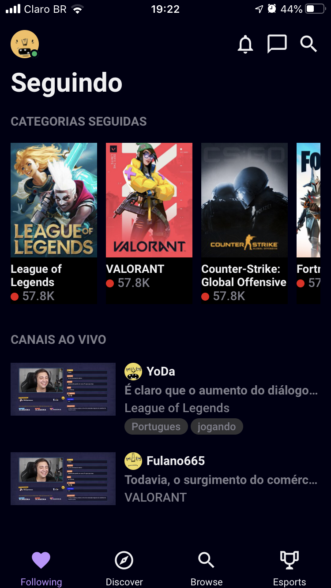

<h1 align="center">
  
</h1>

<h4 align = "center">
  Cópia da principal interface do aplicativo mobile <a href="https://www.twitch.tv/">Twitch.tv</a>
</h4>

<p align="center">
  
</p>

## :rocket: Tecnologias

-  [Expo](https://expo.io/)
-  [ESLint](https://eslint.org/)
-  [TypeScript](https://www.typescriptlang.org/)
-  [React Native](https://reactnative.dev/)
-  [Styled Components](https://styled-components.com/)
-  [React Navigation v5](https://reactnavigation.org/)

## 💻 Sobre o projeto

Recriar a interface do [Twitch.tv](https://www.twitch.tv/) como forma de aprendizagem e treinar as skills perante o uso do React Navite. O desenvolvimento deste projeto só foi capaz graças ao [vídeo](https://www.youtube.com/watch?v=bJVp_vlvMwQ&ab_channel=Rocketseat) publicado pela Rockeseat(agradeço muito pela qualidade do conteúdo produzido).

Para o desenvolvimento deste projeto foi usado o expo-cli, caso você não o tenha instalado basta seguir esse [tutorial](https://expo.io/learn).
## 📥 Instalação e execução

Faça um clone desse repositório e acesse o diretório.

```bash
$ git clone git@github.com:LeeonardoVargas/twitch-app-clone.git && cd twitch-app-clone
```
Agora basta instalar as dependências e executar o expo.

```bash
# Instalando as dependências
$ yarn

# Executanto aplicação
$ expo start
